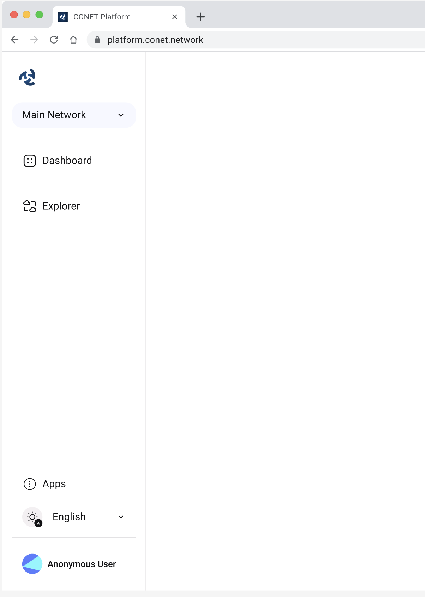

# CONET Platform documentation

The CONET platform is the client used by users to access the CONET Layer Minus protocol network.

<figure><figcaption></figcaption></figure>

The CONET platform based on the Progressive Web Apps (PWA) which can reach anyone, anywhere, on any device with a single codebase.

<figure><figcaption></figcaption></figure>

[**TypeScript**](https://www.typescriptlang.org/docs/handbook/typescript-from-scratch.html)

TypeScript is JavaScript’s runtime with a compile-time type checker. CONET platform uses TpeScript to improve programming quality.

**Decentralized APP Store**

Third-party developers can utilize the CONET platform to access the CONET network infrastructure and develop their own unique applications. Applications are showcased on the CONET platform through the decentralized application store provided by CONET. Users can then install these applications from the CONET platform.

**Contributing**

Report errors in this documentation in[ the issue tracker.](https://github.com/CoNET-project/conet-platform-documentation/issues)
